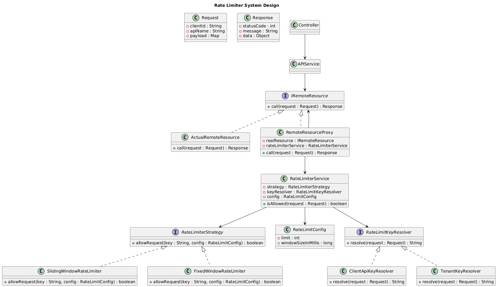

# Pluggable Rate Limiting System for External Resource Usage

This project implements a backend rate-limiting system designed to control access to external, paid resources. Unlike standard API rate limiting, this system intercepts requests only where business logic decides an external call is necessary, saving costs and optimizing quota usage.

## 📋 Requirements

### Functional
- Decision-making for allowing/denying external calls.
- Support for multiple pluggable algorithms:
    - **Fixed Window Counter**
    - **Sliding Window Counter**
- Runtime configuration of limits (e.g., 100 requests per minute).
- Flexible rate-limiting keys (per customer, tenant, API key, or provider).
- Simple interface for internal services.

### Non-Functional
- **Extensible**: Easily add algorithms like Token Bucket, Leaky Bucket, etc.
- **SOLID/OOP**: Clean and maintainable class structure.
- **Thread-safe**: Safe for concurrent request handling.
- **Efficient**: Minimal time and space overhead.

## 📐 Design & Approach

The system uses a combination of the **Proxy** and **Strategy** design patterns to achieve maximum flexibility.

### Proxy Pattern
A `RemoteResourceProxy` wraps the actual external resource call. This ensures that the rate-limiting check is performed transparently before the call ever reaches the external provider.

### Strategy Pattern
Algorithms are implemented as separate strategies. The `RateLimiterService` uses a `RateLimiterStrategy` interface, allowing the system to switch between `FixedWindowRateLimiter` and `SlidingWindowRateLimiter` without changing any business logic.

### UML Design


## 🚀 How to Run

### 📂 File Structure
```text
Rate-Limiter-Design/
└── RateLimiter/
    ├── Main.java
    ├── config/          # RateLimitConfig.java
    ├── controller/      # Controller.java
    ├── model/           # Request.java, Response.java
    ├── proxy/           # IRemoteResource.java, Proxy implementations
    ├── resolver/        # Key resolvers (Tenant, API Key)
    ├── service/         # APIService.java, RateLimiterService.java
    └── strategy/        # Rate limiting algorithms
```

### 🛠️ Compilation
From the project root directory, run:
```powershell
javac -d bin RateLimiter/Main.java RateLimiter/model/*.java RateLimiter/config/*.java RateLimiter/resolver/*.java RateLimiter/strategy/*.java RateLimiter/service/*.java RateLimiter/proxy/*.java RateLimiter/controller/*.java
```

### ▶️ Running the Simulation
Run the following command from the root directory:
```powershell
java -cp bin RateLimiter.Main
```
# LLD_Rate_Limiter
